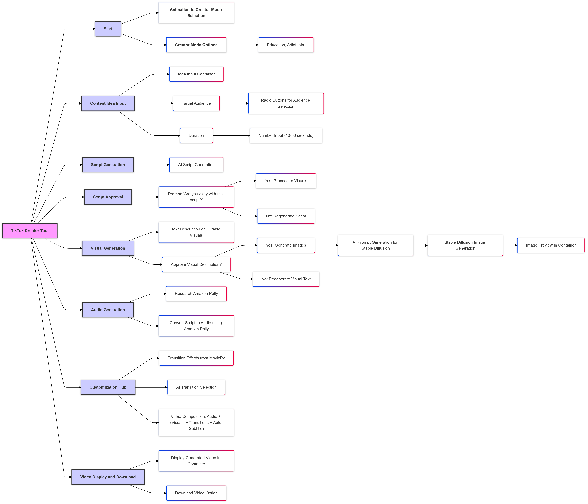

# TikTok_video_maker_Assignment
---
# TikTok Video Creator Tool

This Streamlit application is a tool that empowers users to create engaging TikTok videos with the help of AI. It utilizes a combination of cutting-edge AI models and technologies to automate various aspects of video creation, from script generation to visual and audio integration, and video creation.

## Features

- **AI-Powered Script Generation:**
    - Generates a TikTok script based on a user-provided content idea, target audience, and desired duration.
    - Utilizes **Google's Gemini 2.0 Flash model** via the `google-generativeai` library for natural, engaging, and concise script creation, also making use of prompt engineering and specific tags.
- **Image Generation:**
    - Generates images based on visual descriptions extracted from the script.
    - Uses the **"kudzueye/boreal-flux-dev-v2"** model from the Hugging Face Hub via the `huggingface_hub` library to generate high-quality images for use in the video.
    - Uses `Pillow` library for saving generated image locally.
- **Video Generation:**
    - Combines generated images with a specified transition (crossfade).
     - Uses MoviePy to create a transition, adding transition in between the images.
    - Includes  pre-defined background music and text overlays based on timestamps of the script using MoviePy library.
- **Customizable Options:**
    - Allows users to select a creator mode to influence the tone and style of content.
    - Provides input options for the content idea, target audience, and duration of the video.
    - Users can regenerate the script or images or transition if they are not satisfied.
    - Allows users to download the generated video.

## Project Structure

The project is structured as follows:
```markdown
tiktok_creator_tool/
├── main.py                # Main entry point, navigation, and overall flow
├── pages/
│   ├── 0_start.py         # Animation to Creator Mode Selection
│   ├── 1_content_idea.py  # Content Idea Input, Target Audience, Duration
│   ├── 2_script.py        # Script Generation & Approval
│   ├── 3_visuals.py       # Visual Description, Image Generation & Approval
│   ├── 4_audio.py         # Audio Generation using Amazon Polly
│   ├── 5_customization.py # Transition Effects, Video Composition
│   ├── 6_video.py         # Video Display and Download
└── utils/
    ├── ai_utils.py        # AI related functions
    ├── video_generator.py # Helper functions for video processing
    └── test_video_generator.py # Test file for video generation
```

Note: Code To Be Upload.


```markdown
demo/
├── video.mp4             # Video of the working project
```


## Mindmap
The mindmap below illustrates the brainstorming process I used to design and structure the TikTok Creator Tool project. It covers all the major components, from idea generation to video creation, and outlines the flow of operations in the project.

  # Path to the image file in the image/ folder

## Technologies and AI Models Used

This project leverages the following technologies and AI models:

-   **Streamlit:** An open-source Python framework that enables the creation of interactive web applications with minimal effort. We use it to create our UI
-   **Google Gemini 2.0 Flash (Experimental):** A fast and efficient multimodal AI model from Google, used for generating scripts. This model is accessed via the `google-generativeai` library. It can also perform function calling and also use tools based on use case.
-   **Hugging Face Inference API:** We are using the Hugging Face Inference API to generate images using "kudzueye/boreal-flux-dev-v2" model. It can be used via `huggingface_hub` library.
-   **MoviePy:** A Python library for video editing, used for applying crossfade transitions, adding audio and adding subtitles.
-   **Pillow (PIL):** Used for image handling, such as saving the generated image locally.
-   **Regular Expressions (re):** Used for extracting structured data, such as visual cues, audio suggestions, and text overlays from the generated script.
- **Python:** All the code is using Python as a base.


## Dependencies

The project uses the following Python libraries:

-   `streamlit`
-   `google-generativeai`
-   `python-dotenv`
-   `huggingface_hub`
-   `Pillow`
-   `moviepy`
-   `gradio_client`

## Important Notes

*   **API Keys:** Make sure to replace the placeholder `YOUR_GOOGLE_API_KEY` with your actual Google API key in `.env`.
*   **Hugging Face Model:** The image generation is done with "kudzueye/boreal-flux-dev-v2" model from huggingface hub
*   **Image and Audio Files:** We are using "audio.mp3" in the same directory as a pre-defined audio and the name of the images will be `generated_image_1.jpeg`, `generated_image_2.jpeg`, etc
*   **GPU Quota:** The image generation may be affected due to GPU quota of huggingface model, and to avoid that a small time delay is used during image generation.
*   **Video Path:** We are using a pre-generated `transitioned_video.mp4` file for testing and debugging purposes, in same directory where your code is.
*   **FFmpeg:** You will need to have `ffmpeg` installed and available in your system’s `PATH` so that `moviepy` can be used.
